# Тактическая карта и переигровка операций: описание системы

Система для работы с военно-историческими операциями на карте: нанесение обстановки условными
знаками, хранение карт и сведений об объектах во времени, карты-подложки в закрытом контуре,
переигровка операций с арбитром и языковой моделью в роли противника, база знаний по операциям.

Документ описывает систему целиком. Часть I — что система умеет, из каких частей состоит, как
они связаны, где хранятся данные, как развернуть и проверить. Часть II — модель переигровки:
как считается ход операции, на каких данных, откуда взяты числа, как модель проверяется по
истории и где она ошибается; она написана и для специалистов-историков, которые оценивают
достоверность, и для разработчиков, которые развивают модель.

---

# Часть I. Система

## 1. Назначение

| Задача | Чем решается |
|---|---|
| Нанести обстановку на карту так, как это делают на исторических и штабных картах | редактор тактической карты и библиотека из 238 условных знаков |
| Показать ход операции во времени | шкала времени: знаки появляются, исчезают и движутся по датам |
| Хранить сведения об объектах один раз для всех карт | реестр объектов: формирования, сооружения, пункты; характеристики во времени |
| Работать без интернета | карты-подложки на своём сервере, установка из архива |
| Проверить, как могла пойти операция при других решениях | переигровка: арбитр считает движение, бои, подвоз и окружения |
| Сыграть за одну сторону против модели | игра: противником командует языковая модель, советник помогает игроку |
| Собрать и проверить материалы по операции | база знаний: документы разбираются моделью, полнота материалов считается по каркасу |
| Держать модель в согласии с источниками | сверка базы знаний со сценарием и пересчёт модели после уточнения данных |

## 2. Разделы приложения

Приложение открывается в браузере. Слева — разделы:

| Раздел | Что в нём |
|---|---|
| **Редактор** | тактическая карта: палитра знаков, слои, инспектор знака, шкала времени, файлы и экспорт |
| **Переигровка** | расчёт операции с историческими задачами, сравнение с историей, карта по ходам; принятие командования и игра |
| **Моделирование** | правила арбитра и профили сторон, сравнение с историей, настройка и калибровка правил, подготовка операций |
| **Карты** | карты-подложки (свои, офлайн) и карты местности для переигровки (театры), исторический слой |
| **Знаки** | справочник условных знаков: описание, оформления, источник |
| **Знания** | база знаний по операциям: записи, документы, полнота материалов, вопросы к модели |
| **ИИ** | связь с языковой моделью (LM Studio), модели по ролям |

На телефоне те же разделы; экран командования в игре переключается между штабом, картой и советником.

## 3. Редактор тактической карты

### 3.1. Знаки и оформления

Знаки рисуются в географических координатах поверх любой подложки. Одна система знаков имеет
три оформления, которые меняют только начертание:

- **Уставные знаки РККА** — нормативные, по первоисточнику TM 30-430 «Handbook on U.S.S.R.
  Military Forces», гл. XII (1946): штабы флажками по ступеням, ромбы танков, ДОТ и ДЗОТ,
  заграждения, разграничительные линии; свои — красным, противник — синим;
- **Историческая карта** — манера атласов: стрелки-клинья с градиентом вдоль оси, линии фронта
  по датам, оборонительные рубежи, овалы танковых армий;
- **Инфографика** — манера современных схем: сплошные стрелки и стрелки с растворяющимся
  хвостом, окружённые группировки со штриховкой.

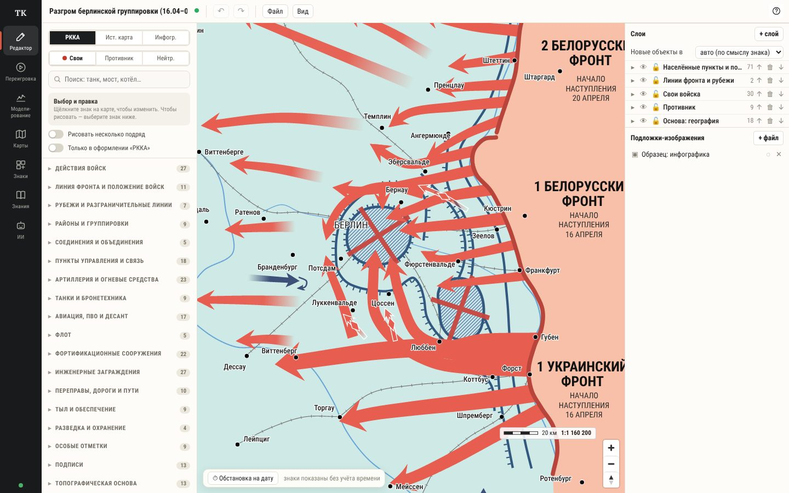

*Пример «Берлинская операция — инфографика» (меню «Файл → примеры»): стрелки ударов фронтов с привязкой хвостов к линии фронта, окружённые группировки, населённые пункты, железные дороги. Слева — палитра знаков по категориям, справа — слои.*

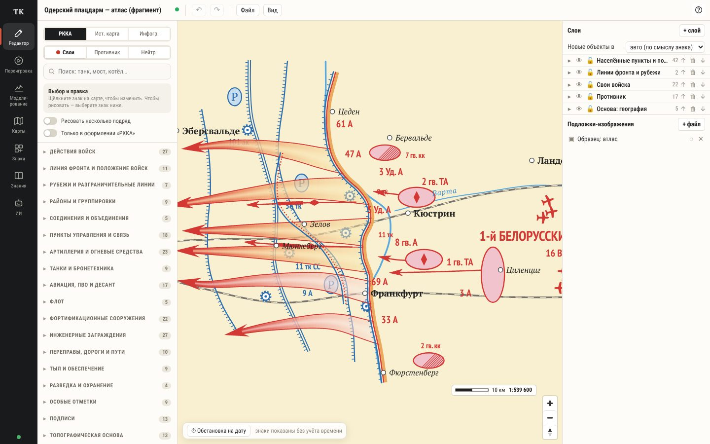

*Тот же редактор в оформлении «Историческая карта»: стрелки-клинья, овалы танковых армий, резервы «Р», рубежи обороны.*

Стрелка рисуется щелчками от хвоста к острию; хвост, начатый у линии фронта, привязывается к
ней и следует за линией при её правке. У стрелок настраиваются ширина и её сужение,
наконечник, заливка вдоль изогнутой оси, контур, блик и украшения на оси. Линии собираются из
параллельных слоёв с зубцами, засечками и пунктиром — так строятся многоцветные линии фронта,
рубежи, позиции подразделений. Правка: перетаскивание объекта и узлов, добавление и удаление
узлов, ручки ширины и наконечника; отмена и повтор, дублирование.

### 3.2. Слои, масштаб, подложки

- **Слои.** Каждый знак лежит в слое: основа, линии фронта, свои войска, противник, подписи и
  свои слои. Слой можно скрыть, заблокировать, сделать полупрозрачным, переименовать,
  переставить. Новые знаки в режиме «авто» ложатся в слой по смыслу знака.
- **Масштаб.** Размер знаков задаётся на масштабе, на котором они нарисованы; при зуме
  оформление растёт и уменьшается в пределах ×0,5–×1,5 (или постоянно, или как на местности).
  Слою и знаку можно задать масштабы, на которых он виден: стрелки фронтов — на мелких,
  дивизии — на крупных, как на штабных картах. Экспорт — всегда со всеми знаками.
- **Подложки.** «Бумага», OpenStreetMap, OpenTopoMap, спутник, любая XYZ/WMS без кода, свои
  карты из раздела «Карты» (работают без интернета) и сканы, привязанные за углы, с прозрачностью.

### 3.3. Время и реестр объектов

Под картой — шкала времени: карта показывает обстановку на выбранный момент, знаки появляются и
исчезают по своим периодам и движутся между положениями плавно или скачком; есть проигрывание с
выбором скорости. Время — московское и местное (по месту событий, с историческими правилами
часовых поясов).

Знак можно связать с **объектом реестра** («5 уд. А», «Рейхстаг»): характеристики объекта
(номер, ступень, род войск; во времени — подчинение, командир, численность, положение) хранятся
один раз и видны со всех карт. Изменения записываются фактами «с даты» со ссылкой на источник.
Реестр отвечает и на пространственно-временные вопросы: «какие объекты были в этом районе на
25 апреля».

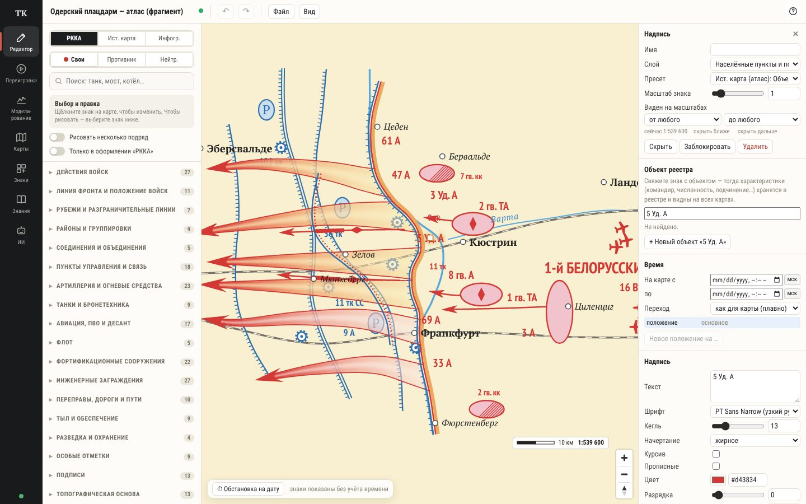

*Выбранная надпись «5 Уд. А»: слой и оформление, масштабы видимости, связь с объектом реестра (найти или создать), период присутствия на карте и положения по датам, параметры текста.*

### 3.4. Совместная работа, обмен, экспорт

- **Сервер.** Карты сохраняются на сервер с ревизиями (хранятся 50 последних). Если карту
  успели изменить, редактор предлагает перезаписать или загрузить свежую версию. Правки другого
  пользователя или внешней системы приходят потоком событий и подгружаются сами.
- **Без сервера** редактор работает целиком в браузере: карта сохраняется в браузере автоматически.
- **Файлы:** документ JSON; GeoJSON в обе стороны (на выбранный момент времени); SVG со слоями —
  группами Inkscape и Illustrator; PNG как на экране (с картой) и PNG только знаков, со
  встроенными шрифтами.
- **Внешние системы** могут владеть своим слоем карты и заливать в него данные в GeoJSON —
  остальная карта не затрагивается.

## 4. Библиотека знаков

238 элементов в 18 категориях: действия войск; линия фронта и положение войск; рубежи и
разграничительные линии; районы и группировки; соединения и объединения; пункты управления и
связь; артиллерия; танки и бронетехника; авиация, ПВО и десант; флот; фортификационные
сооружения; инженерные заграждения; переправы, дороги и пути; тыл; разведка и охранение;
особые отметки; подписи; топографическая основа. У каждого знака — описание, оформления,
учёт принадлежности (свои, противник, нейтральные) и источник со страницей. Знаки, которых в
первоисточнике нет, помечены «сверить» (28).

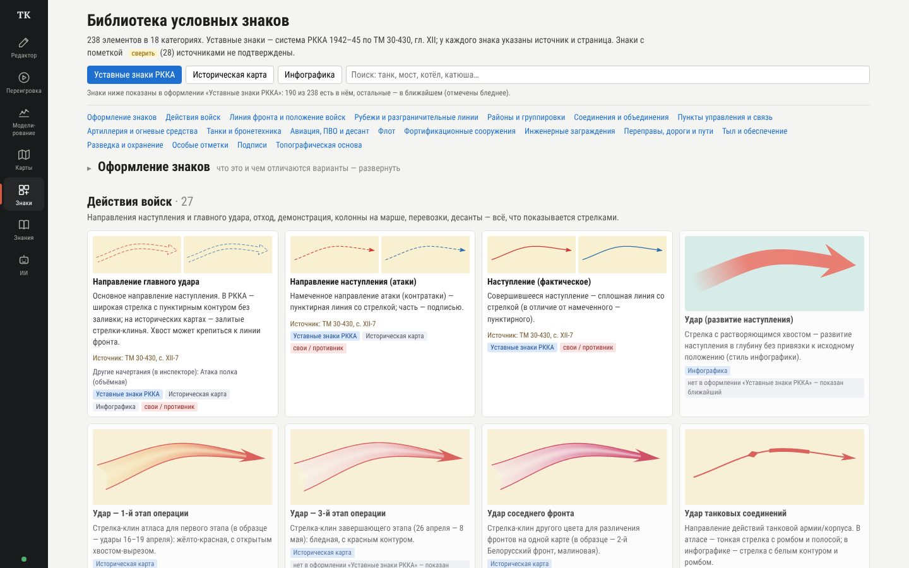

*Справочник знаков: переключение оформления, поиск, описание и источник у каждого знака. Полный перечень — [library.md](library.md), печатный справочник — [library.pdf](library.pdf).*

## 5. Карты: подложки и театры

**Подложки в закрытом контуре.** Сервис картографии хранит тайловые карты у себя и отдаёт их
редактору. Карты попадают туда тремя путями: загрузкой тайлов внешнего сервиса, пока он доступен
(район и уровни задаются, ход загрузки виден); нарезкой привязанного скана; пакетом из другой
установки. Импортируются и карты других программ: MBTiles, Locus/RMaps `.sqlitedb`,
OziExplorer `.map` с растром. Подложку можно показать районом или подложить под любую карту
системы. Подробно — [cartography.md](cartography.md).

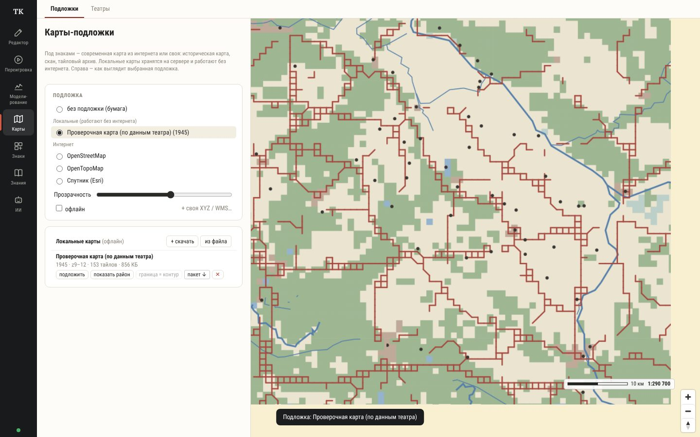

*Список своих карт и предпросмотр; «подложить» — показать под картами редактора и переигровки.*

**Театры** — карты местности для переигровки: сетка клеток с покровом (ESA WorldCover),
рельефом (Copernicus DEM), реками, дорогами, мостами, районами (OpenStreetMap) и укреплениями.
Новый театр собирается по области на сервере. **Исторический слой**: по подложенной карте того
времени стенд распознаёт по образцам цвета дороги, застройку, воду, лес и сравнивает дороги
карты с дорогами театра — современные дороги, которых в 1945 г. не было, можно убрать.

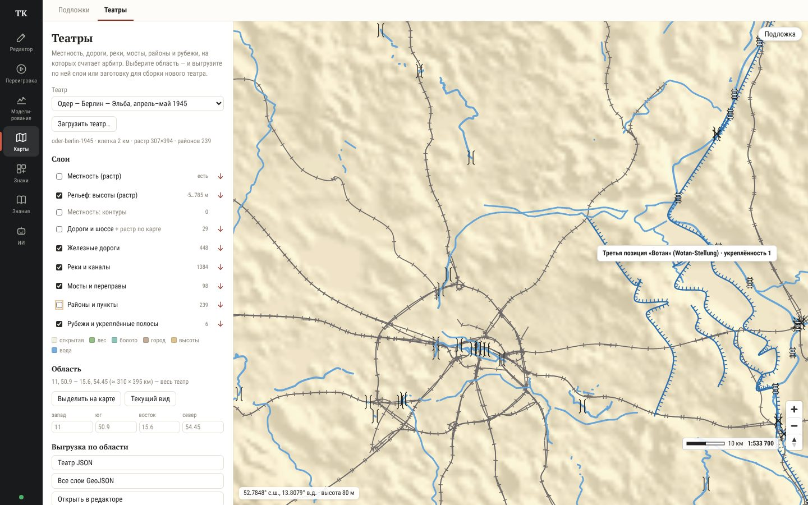

*Театр Одер — Берлин: рельеф, реки, железные дороги, мосты и укреплённые полосы («Вотан»); слева — слои театра, область и выгрузка.*

## 6. Переигровка и игра

**Переигровка.** Выбирается операция (Берлинская, бой в Берлине, Висло-Одерская или своя),
набор правил и число прогонов. Обе стороны получают исторические задачи; арбитр считает
движение (по дорогам, с разбросом путей вне городов), бои, подвоз, окружения, территорию.
Результат сравнивается с историей: доля положений в допуске, ключевые события по дням. Карта
показывает расчёт по ходам на трёх масштабах — тактическом, оперативном, стратегическом — с
историческими положениями и фронтом для сравнения, боями, рубежами и участками.

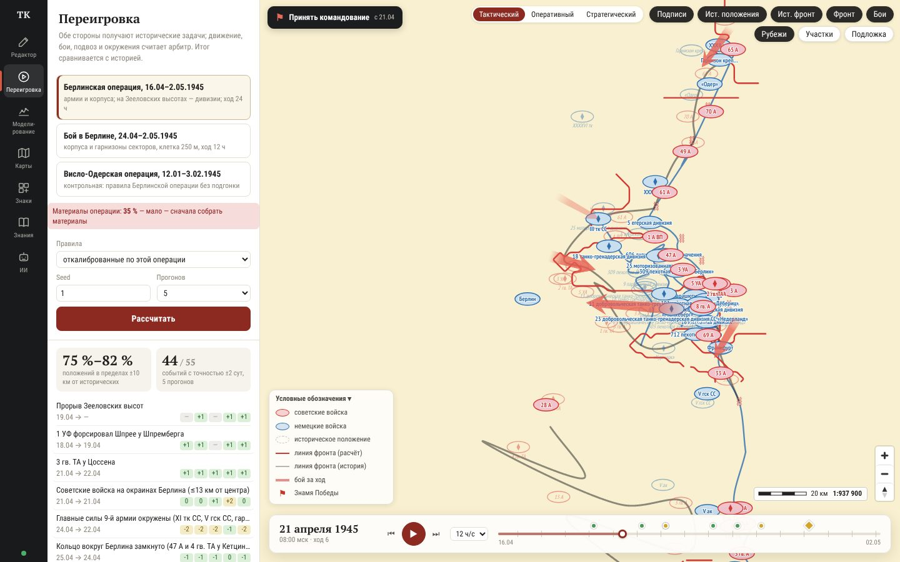

*Расчётный фронт (красный) и исторический (серый), бледные знаки — исторические положения, стрелки — бои за ход. Слева — события по пяти прогонам.*

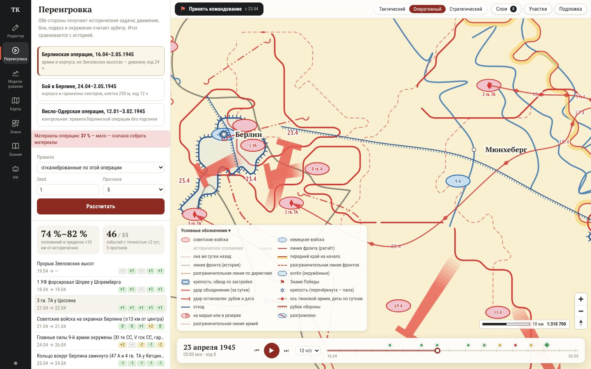

*Тот же момент в оперативном масштабе: армии и корпуса.*

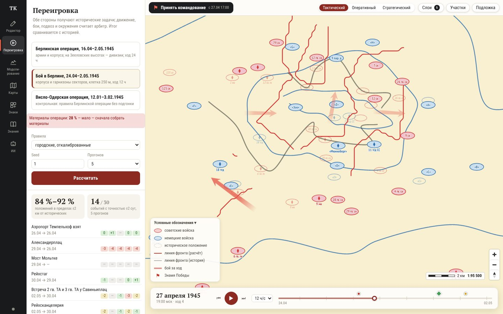

*Бой в Берлине (клетка 250 м, ход 12 ч), 27 апреля: советские корпуса у кольца S-Bahn, немецкие гарнизоны секторов A–H и Z. В допуске ±2 км — 84–92 % положений.*

**Игра.** С любого момента переигровки можно принять командование одной стороной. Противником
командует **штаб на модели**: на каждом ходу он получает только то, что мог знать (свои войска,
противник в пределах разведки, итоги суток, ограничения сверху), и отдаёт приказы в той же форме,
что и человек. Игрок получает доклады и разведсводку (туман войны), принимает решение на ход
(оценка обстановки, замысел, риски, донесение), отдаёт приказы войскам и распоряжения по тылу,
переправам и резервам. Арбитр исполняет только приказы в строгой форме; свободный текст идёт в
журнал и советнику.

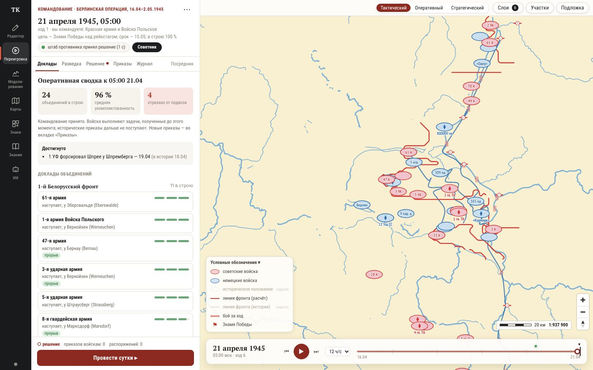

*Командование 1-м Белорусским фронтом: оперативная сводка, донесения за ход, доклады объединений.*

**Советник** отвечает на вопросы игрока, видя то же, что игрок, и точные правила арбитра;
готовит варианты решения на ход (решительный, осторожный, манёвренный), которые можно принять
целиком или по частям. Ответ, где названы соединения противника вне разведки, проверяется
программно. **Посредник** показывает решения штаба противника — после игры или по желанию; по
выбору модель-посредник даёт ограниченную поправку к бою (в пределах 0,8–1,25) с опорой на
справку из базы знаний.

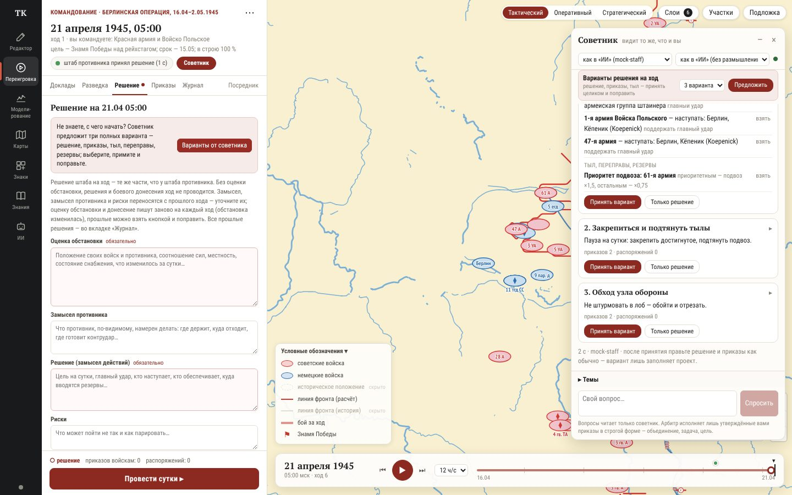

*Варианты решения на ход: оценка, замысел, приказы и распоряжения — каждый можно взять в проект.*

Игра идёт до победы или поражения, сохраняется в браузере после каждого хода и восстанавливается
по записи целиком (движок детерминирован). **Разбор операции** — отчётный документ модели по
записи игры от лица экспертов (замысел и ведение операции, разведка, тыл, переправы,
управление, резервы, сравнение с историей, оценка и уроки), с выгрузкой в PDF.

## 7. Моделирование

Раздел для тех, кто проверяет и развивает модель:

- **Модели** — наборы правил арбитра словами и числами (бой, оборона, движение, подвоз,
  калибровка), профили сторон, языковые модели по ролям;
- **Сравнение** — до четырёх наборов правил на одной операции против истории: положения по
  дням, события, отчёт;
- **Настройка** — свой вариант правил;
- **Калибровка** — подбор множителей правил по истории операции (обучение — первая половина,
  проверка — вторая), в браузере, параллельно;
- **Операции** — загрузка своей операции пакетом (сценарий, театр, история), проверка,
  контрольный прогон, подготовка к переигровке; материалы, полнота, сверка с базой, пересчёт
  (раздел 8).

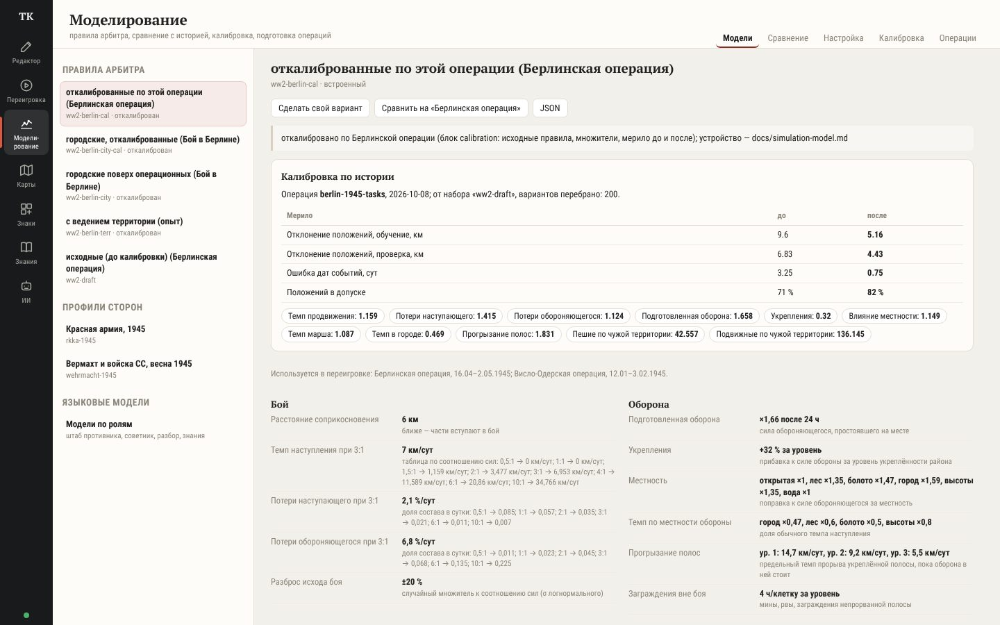

*Набор правил `ww2-berlin-cal`: блок калибровки (мерило до и после, множители) и таблицы арбитра словами.*

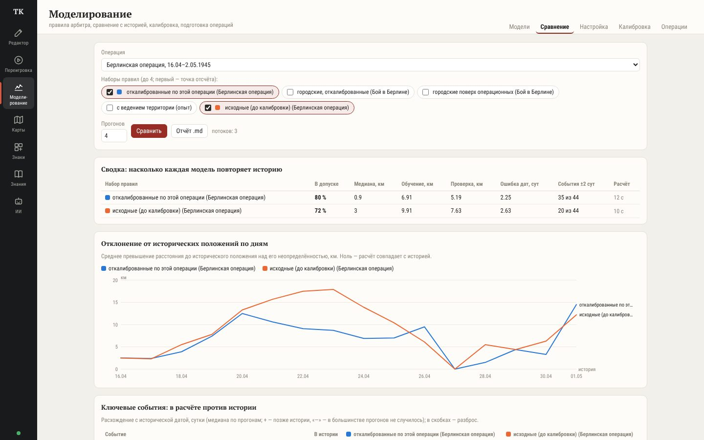

*Исходные и откалиброванные правила на Берлинской операции: доля положений в допуске, события, отклонение по дням.*

Как устроен расчёт, откуда числа и насколько модель совпадает с историей, — часть II.

## 8. База знаний и подготовка операции

**База знаний** — сведения по операциям в каркасе категорий: операции, сражения и бои,
формирования, командование, организация и доктрина, вооружение, театр, хронология, источники;
рубрикатор с нумерацией. У каждого факта — источник, достоверность (A, B, C) и, для извлечённых
из документов, дословная цитата. Материалы сгруппированы по операциям. Поиск — по словам и по
смыслу (эмбеддинги модели). Модель отвечает на вопросы и рассказывает по теме только по
материалам базы, со ссылками; советник в игре получает из неё справки (доктрину, технику — без
хода боёв в истории).

Перед моделированием операции нужны материалы: численность и состав формирований, задачи,
положения по дням, события, состояние мостов и дорог. Стенд помогает их собрать и показывает,
чего не хватает.

### 8.1. Материалы операции и база знаний

В карточке операции («Моделирование → Операции») загружаются документы: книги, донесения,
журналы боевых действий (PDF с текстом, Word, HTML, txt) с указанием достоверности (A, B, C).
Модель разбирает документ по частям и выписывает:

- **записи в базу знаний** — в раздел этой операции (формирования, пункты, бои, хроника,
  нормативы) с дословной цитатой; без цитаты запись отбрасывается;
- **сведения об инфраструктуре** — мосты, переправы, дороги, железные дороги: что, где, в
  каком состоянии, с какой даты, чьими силами;
- **положения формирований по дням** — кто, когда, где (раздел 8.4).

Под документом видно, что извлеклось: сколько новых записей, дополнений, сведений об
инфраструктуре. Каждое сведение показано с цитатой и с тем, как оно ляжет на театр («в
расчёте: переправа действует с 17.04» или «на театре не найдено — останется сведением»).
Человек принимает или отклоняет; принятое попадает в расчёт и в базу знаний.

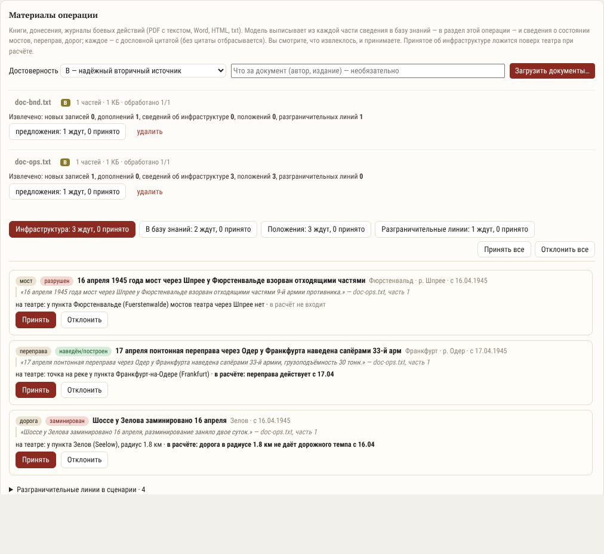

*Проверочный документ о переправах: модель выписала три сведения — мост у Фюрстенвальде взорван 16.04 (на театре такого моста нет — останется сведением), понтонная переправа у Франкфурта наведена 17.04, шоссе у Зелова заминировано 16.04 (в радиусе 1,8 км дорога не даёт дорожного темпа).*

База знаний сгруппирована по операциям: у каждой операции свой раздел, а общие сведения
(организация, вооружение, доктрина) — отдельно, чтобы материалы разных операций не смешивались.
В разделе «Знания» операция выбирается вверху; модель отвечает на вопросы только по материалам
базы, со ссылками.

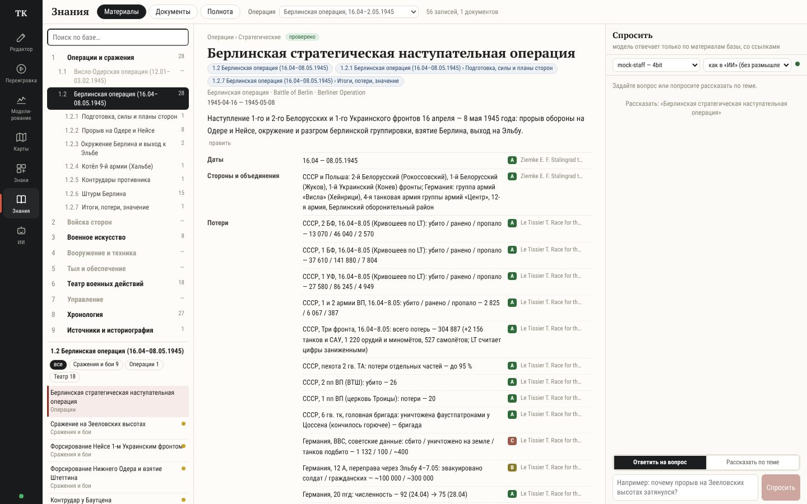

*Раздел «Знания»: рубрикатор слева, запись об операции с фактами, источниками и достоверностью, справа — вопросы к модели по базе.*

### 8.2. Полнота материалов по каркасу

Полнота — **не мнение модели**, а проверка по каркасу базы знаний: из данных операции
(сценарий, история, театр) стенд выводит, какие элементы должны быть описаны, и для каждого —
какие сведения должны быть, а затем ищет их в записях базы.

| Раздел | Группа | Что требуется | Вес |
|---|---|---|---|
| Войска и командование | Формирования | по каждому действующему: подчинённость, командир, состав, численность, танки, орудия, боевой путь в операции | 0,20 |
| | Командование | командующие армий и фронтов: звание, должность, ключевые решения | 0,06 |
| | Положения по дням | в какие дни известно положение формирования | 0,10 |
| Местность и инфраструктура | Пункты и районы | цели приказов и места событий: что это, где, особенности, оборона, значение | 0,10 |
| | Рубежи и укрепления | где, устройство, кто оборонял, значение | 0,06 |
| | Реки | особенности, мосты и переправы, значение | 0,03 |
| | Мосты и переправы | известно ли состояние моста на большой реке района | 0,06 |
| Ход операции | Операция | даты, стороны, замысел, силы, итог, потери | 0,05 |
| | Сражения и бои | по каждому участку: даты, место, силы, ход, исход, потери | 0,08 |
| | События | запись о каждом ключевом событии истории (±1 сут) | 0,12 |
| | Погода и грунт | погода, дороги, ледостав | 0,02 |
| Стороны | Организация и тактика | наступление, оборона, бой в городе, форсирование, рода войск, тыл | 0,04 |
| | Вооружение и техника | тип, вооружение, броня, масса, скорость, экипаж, дальность | 0,04 |
| | Нормативы | нормативы для проверки правил: запись, источник, достоверность A/B | 0,02 |
| Источники | Источники | ≥ 3 документов операции, из них хотя бы один A; 80 % фактов с источником | 0,02 |

Полнота элемента — доля требуемых сведений, полнота группы — среднее по элементам (формирования
взвешены по уровню: фронт и армия весят больше дивизии), итог — взвешенное среднее групп.
Уровни: **от 75 %** — достаточно (✓, зелёный), **45–75 %** — частично (◐, жёлтый), **меньше 45 %** —
мало (✕, красный): сначала собрать материалы. Уровень всегда показан значком и словом, не только
цветом. Полнота видна в карточке операции, в «Знаниях» (вкладка «Полнота») и в «Переигровке».

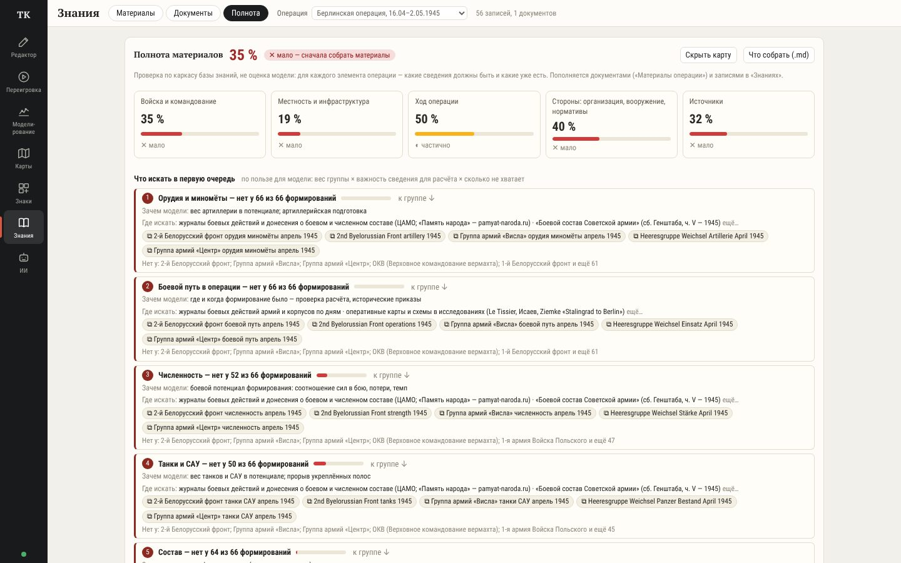

*Полнота Берлинской операции: 35 % («мало»). По разделам: войска 35 %, местность 19 %, ход операции 50 %, стороны 40 %, источники 32 %. Ниже — что искать в первую очередь.*

**Наглядность дефицитов.** У каждой группы — полоса полноты и раскрывающаяся матрица «элемент ×
сведение» (есть / нет) с фильтром по стороне; над матрицей — по каждому сведению, у скольких
элементов оно есть. **Карта пробелов** показывает элементы на местности цветом уровня:
формирования (▲ СССР, ▼ Германия), пункты, мосты и переправы, участки боёв, события; щелчок по
знаку раскрывает его группу.

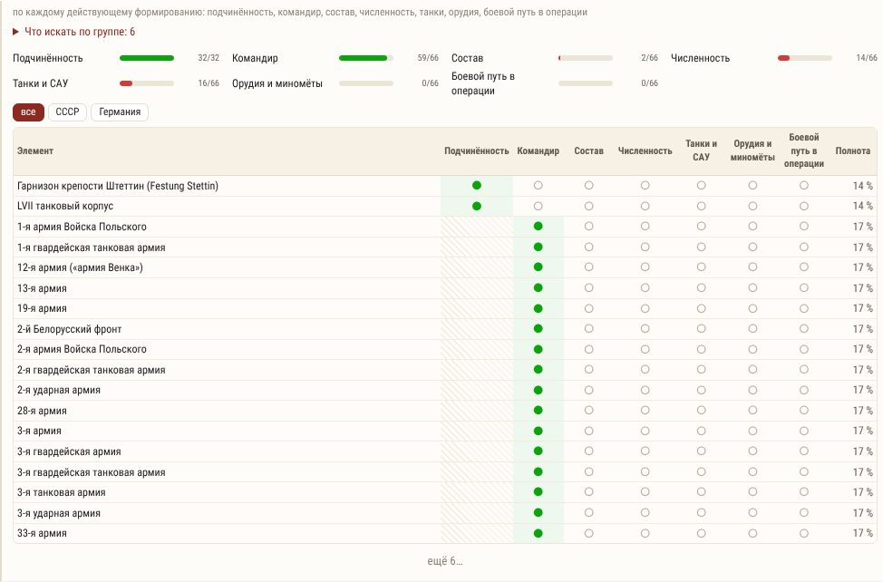

*Группа «Формирования»: подчинённость есть у 32 из 32, командир — у 59 из 66, а состав, численность, танки, орудия и боевой путь — почти ни у кого.*

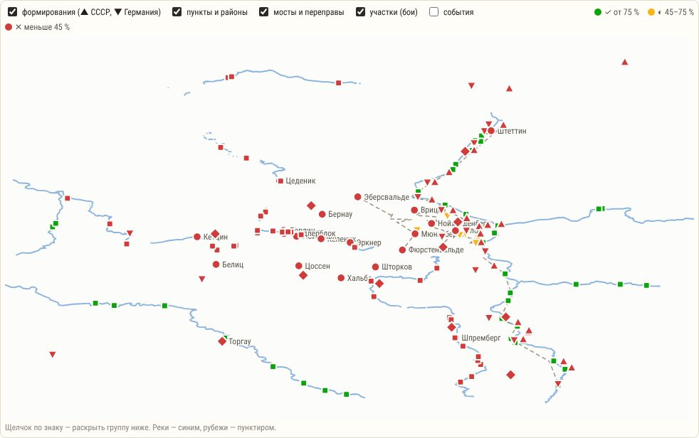

*Карта пробелов: красное — мало сведений, зелёное — достаточно. Хорошо описаны мосты на Одере (зелёные квадраты), плохо — пункты и формирования в глубине.*

**Подсказки, что искать.** По дефицитам стенд составляет подсказки: что найти («Численность —
нет у 52 из 66 формирований»), зачем это модели (на что влияет в расчёте), где обычно есть такие
сведения (типы источников и известные издания: ЦАМО и «Память народа», «Боевой состав Советской
армии», журналы боевых действий, Le Tissier, Исаев, Ziemke), готовые поисковые запросы по-русски,
по-немецки и по-английски и элементы, у которых сведений нет. Порядок — по пользе для модели:
вес группы × важность сведения для расчёта × доля, которой не хватает. Весь список выгружается
файлом «Что собрать (.md)» — задание на поиск материалов.

### 8.3. Сверка базы знаний со сценарием

База знаний — общее место сведений об операции; расчёт же берёт численность, танки и орудия из
сценария. Панель «Сверка с базой знаний» в карточке операции связывает их в обе стороны.

**База → сценарий.** Для каждого действующего формирования стенд находит записи базы (по id
сценария в синонимах записи или по названию) и факты «численность», «танки и САУ», «орудия» на
начало операции: без даты или датированные не позже чем через двое суток после начала; факты с
оговоркой «не численность на …» не берутся. Из нескольких выбирается самый достоверный (A, затем
B, C). Танки и САУ, записанные отдельными фактами, складываются — в сценарии они вместе.
Численность в сценарии боевая (раздел 18.1), поэтому списочная численность из базы умножается на
долю боевых войск (0,6 — советские, 0,75 — немецкие), если факт не назван боевым. Расхождение
больше 5 % (и больше 500 человек, 5 танков, 20 орудий) — предложение исправить сценарий, с
источником, достоверностью и цитатой.

Принятое ложится **правкой операции** поверх сценария (встроенный сценарий в сборке не
меняется): прежнее значение запоминается, правку можно вернуть. Правки действуют везде — в
переигровке, игре, сравнении и калибровке.

**Сценарий → база.** Сведения, которыми расчёт уже пользуется, а в базе их нет, предлагается
внести в базу: цифры сценария (как оценку стенда — достоверность C, с пометкой, как получены),
подчинённость, а также **боевой путь** — положения по дням из истории сценария с её источниками.
Записи формирований, которых в базе нет, создаются. Так база знаний описывает то, на чём стоит
модель, и видно, что ещё держится на оценках.

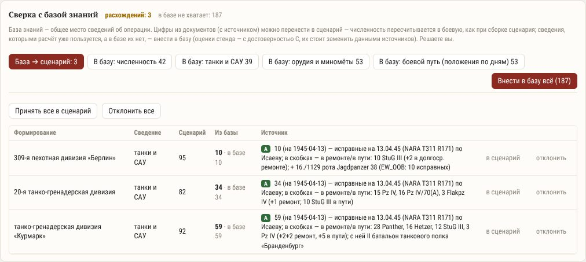

*Берлинская операция: три расхождения «база → сценарий» — танки трёх немецких дивизий (в сценарии — по распределению численности армии, в базе — исправные на 13.04 по Исаеву), и 187 сведений, которых в базе нет: численность, танки, орудия, боевой путь.*

### 8.4. Положения из документов

При разборе документа операции модель выписывает и положения формирований: кто, в какой день,
у какого пункта — с дословной цитатой. Положение без даты, без места или без цитаты в тексте
отбрасывается. Стенд сопоставляет формирование со сценарием (по названию, синонимам записей
базы или по номеру и роду: «8 гв. армия» — «8-я гвардейская армия») и пункт — с театром.

Принятое положение ложится:

- **в базу знаний** — фактом «боевой путь» записи формирования, с цитатой и документом;
- **в историю операции** — если формирование есть в сценарии, а пункт на театре: с
  неопределённостью по ступени (армия ±15 км, корпус ±8, дивизия ±5) и с достоверностью
  документа. По нему сверяется расчёт и идёт калибровка; полнота «Положения по дням» растёт.

Положения в истории видны списком; любое можно убрать (в базе факт остаётся).

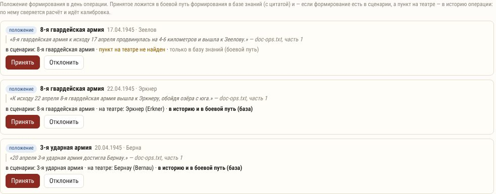

*Три положения из проверочного документа: два ложатся и в историю, и в базу; для третьего пункт «Зеелов» на театре не найден (там «Зелов») — только в базу.*

### 8.5. Пересчёт модели

Каждое изменение данных операции записывается: правка сценария, положение в истории, сведение
об инфраструктуре, внесение в базу. Панель «Пересчёт модели» показывает, что изменилось после
последнего пересчёта, и одной кнопкой:

1. прогоняет операцию на текущих правилах (5 прогонов) — «до»;
2. подбирает множители правил (раздел 21) по первой половине операции: каждый вариант — по двум
   прогонам; 32, 64 или 128 вариантов;
3. перепроверяет три лучших варианта на тех же пяти прогонах, что и «до», и берёт лучший по
   мерилу; если лучше текущих правил ничего нет — правила остаются прежними, и это сказано;
4. прогоняет контрольную операцию (для Берлинской — Висло-Одерскую) со старыми и новыми
   правилами: стало хуже больше чем на 2 % положений — предупреждение о подгонке;
5. сохраняет новые правила своим набором и пишет отчёт: что изменилось в данных, до и после,
   множители, контрольная.

Основными новые правила делает человек («Сделать основными»): набор становится первым в
«Переигровке» и исходным для следующего пересчёта; вернуть встроенные можно в любой момент.
Если на контрольной операции стало хуже, стенд просит подтверждения.

**Итог пересчёта пишется в базу знаний** — в запись «Калибровка модели: <операция>» (рубрика
«Устройство модели стенда»): отчёт целиком и факт с числами до и после. Советнику в игре такие
записи не подаются.

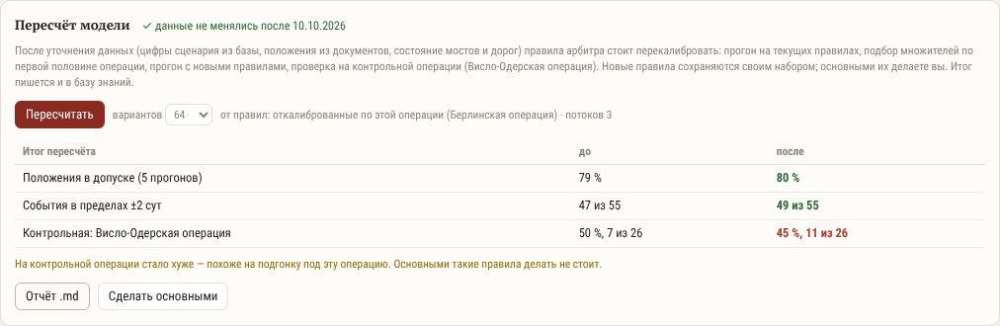

*Пересчёт после сверки и положений из документа (64 варианта): положения 79 → 80 %, события 47 → 49 из 55, но на контрольной операции положения 50 → 45 % — стенд предупреждает о подгонке и не предлагает делать такие правила основными без подтверждения.*

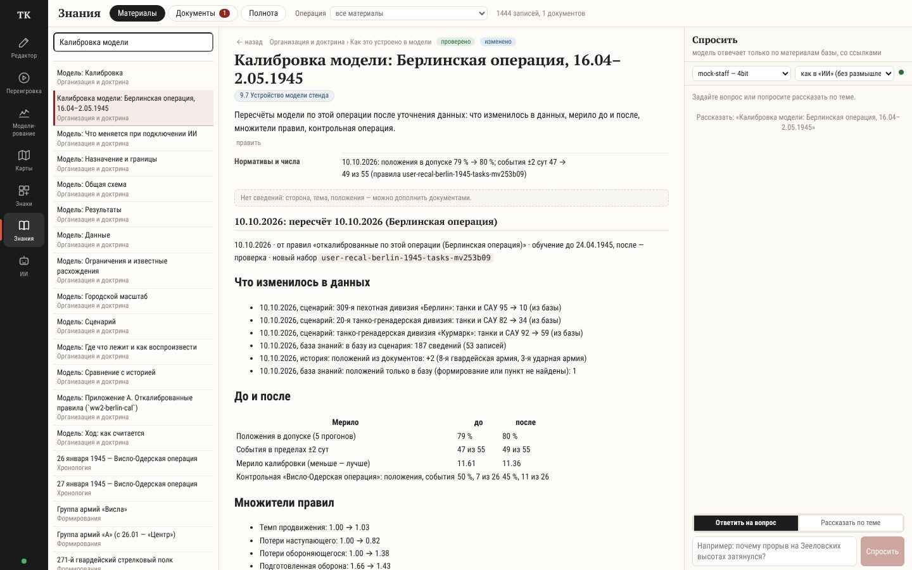

*Запись «Калибровка модели» в разделе «Знания»: что изменилось в данных, мерило до и после, сдвинутые множители.*

## 9. ИИ: языковые модели

Языковые модели работают на компьютере пользователя через LM Studio (или любой сервер с
совместимым API); данные наружу не уходят. Роли:

| Роль | Что делает |
|---|---|
| Штаб противника | решение на ход за немецкую сторону: оценка, замысел, приказы, доклады |
| Советник | ответы игроку, варианты решения на ход |
| Посредник | ограниченные поправки к боям с опорой на базу знаний (по выбору) |
| Разбор | отчётный документ по записи игры |
| Знания | разбор документов, ответы и рассказы по базе |
| Эмбеддинги | смысловой поиск по базе знаний |

Для каждой роли можно выбрать модель и режим размышления. Без LM Studio систему проверяют на
подставной модели (`npm run llm:mock`): её ответы простые, только для проверки интерфейса.
Решения модели проверяются программно: что не сопоставилось с обстановкой, не исполняется и
помечается с причиной.

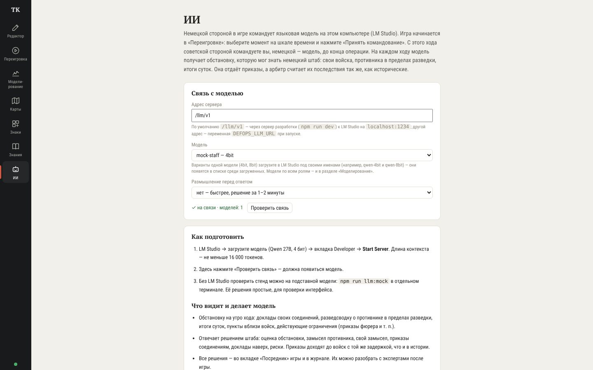

*Связь с моделью: адрес сервера, модель, размышление; как подготовить LM Studio и что видит модель.*

## 10. Архитектура

Монорепозиторий: библиотеки, микросервисы за API-шлюзом и редактор.

```
                 ┌────────────────────────── браузер ──────────────────────────┐
                 │  apps/editor (React)                                         │
                 │   ├─ @def-ops/core        — знаки, слои, SVG, GeoJSON        │
                 │   ├─ @def-ops/sim         — арбитр (в фоновых потоках)       │
                 │   ├─ @def-ops/knowledge   — база знаний, поиск, полнота      │
                 │   ├─ @def-ops/api-client  — клиент API                       │
                 │   └─ engine/MapEngine     — адаптер карты (MapLibre)         │
                 └──────────────┬──────────────────────────────┬────────────────┘
   внешние системы ─ ключ ─►  /api/*                         /llm ──► LM Studio (на машине пользователя)
                 ┌──────────────▼───────────────┐
                 │ services/gateway :8080       │ ключ → организация, маршрутизация, статика
                 └──┬──────────┬──────────┬─────┴──────────────┐
                    ▼          ▼          ▼                    ▼
              documents     render     registry          cartography
               :8101         :8102      :8103               :8104
            карты, ревизии  SVG,       объекты,           подложки офлайн:
            слои, события   GeoJSON    факты во времени   тайлы, сканы, пакеты
                    │                     │                    │
                    └────────► PostgreSQL + PostGIS ◄───────────┘    том tiles-data
```

| Часть | Ответственность |
|---|---|
| `packages/core` | модель документа, слои, геопривязка, рендер знаков в SVG, GeoJSON; без зависимостей от окружения — тот же код рисует в редакторе и на сервере |
| `packages/sim` | симулятор операций: театр, арбитр, игра, доклады, сравнение с историей, калибровка |
| `packages/knowledge` | база знаний: каркас, рубрикатор, поиск, извлечение из документов, полнота, подсказки, сверка со сценарием |
| `packages/service-kit`, `packages/db`, `packages/api-client` | каркас сервисов, PostgreSQL с миграциями по схемам, клиент API |
| `services/gateway` | единая точка входа: API-ключи → организации, маршрутизация, CORS, статика редактора |
| `services/documents` | хранение карт: ревизии, оптимистичная блокировка, слои, события (SSE) |
| `services/render` | SVG и GeoJSON по документу (в т. ч. на момент времени), импорт GeoJSON, каталог знаков; без состояния |
| `services/registry` | реестр объектов: типы и схемы характеристик, факты во времени, пространственно-временные запросы (PostGIS) |
| `services/cartography` | карты-подложки офлайн: тайловые пирамиды, загрузка тайлов, нарезка сканов, пакеты, импорт карт других программ |
| `services/staff` | промпты и разбор ответов языковой модели: штаб, советник, посредник, разбор; контрольные обстановки; подставная модель |
| `apps/editor` | приложение: все разделы |

Принципы: предметная логика — в библиотеках без окружения; сервисы по ответственности, общение
по HTTP/JSON; снаружи доступен только шлюз; открытые форматы (JSON по OpenAPI, GeoJSON, SVG со
слоями); заменяемые части за интерфейсами — хранилище, картографический движок, подложки, шина
событий. Подробно — [architecture.md](architecture.md).

## 11. Данные и хранение

| Данные | Где |
|---|---|
| Карты (документы) с ревизиями | PostgreSQL, схема `documents` (без БД — файлы); в браузере — черновик |
| Реестр объектов и факты во времени | PostgreSQL + PostGIS, схема `registry` |
| Карты-подложки | том `tiles-data` (тайлы по организациям), описание — схема `cartography` |
| Встроенные операции: сценарии, театры, история, правила, профили | в сборке (`packages/sim/data`) |
| Исторические наборы данных (выписки из источников) | `docs/sources` — только факты и пересказы, без текстов книг |
| Начальная база знаний | в сборке (`packages/knowledge/data/seed.json`) |
| Свои операции, театры, правила, сведения об инфраструктуре, правки операций, игры | браузер (IndexedDB) |
| Слой пользователя базы знаний: записи, документы, предложения | браузер (IndexedDB); выгрузка и загрузка файлом |

У каждой организации — свои данные (`X-Tenant-Id` выставляет шлюз по ключу). Модель реестра и
времени — [data-model.md](data-model.md).

## 12. Интеграция

- **REST API** через шлюз (`/api/...`), контракт — [openapi.yaml](openapi.yaml);
  типизированный клиент `@def-ops/api-client` для браузера и Node.
- **GeoJSON** в обе стороны; внешняя система может владеть своим слоем карты.
- **Поток событий** (SSE): изменения карт, реестра, ход заданий картографии.
- **Другие картографические движки** — реализацией интерфейса `MapEngine`; подложки XYZ/WMS — без кода.
- **Языковая модель** — любой сервер с API, совместимым с OpenAI (LM Studio по умолчанию).

## 13. Развёртывание

**Одной командой** (Docker Desktop или Docker Engine с Compose v2; ~4 ГБ памяти):

```bash
./scripts/start-local.sh            # macOS / Linux
.\scripts\start-local.ps1           # Windows (PowerShell)
```

Открывается `http://localhost:8080/` — приложение со всеми сервисами и PostgreSQL + PostGIS.
`stop`, `logs`, `reset` — остановить, журналы, удалить данные; `PORT=…` — другой порт.

**Закрытый контур.** На машине с интернетом `./scripts/offline-bundle.sh` собирает архив со
всеми образами и конфигурацией (~300 МБ); на целевой машине — распаковать и `./install.sh`
(Windows: `install.ps1`). Карты-подложки переносятся пакетами из раздела «Карты». Языковая модель —
LM Studio на машине пользователя.

**Доступ.** `AUTH=keys` и `API_KEYS="ключ:организация,…"` — обязательные ключи по организациям;
в разработке ключ не нужен. Корпоративный прокси и свои сертификаты поддерживаются при сборке.

## 14. Разработка и проверка

```bash
npm ci                    # зависимости ровно по package-lock.json
npm run dev               # приложение: http://localhost:5173/
npm run dev:services      # сервисы для разработки (шлюз :8080); без БД — файлы и память
npm run llm:mock          # подставная модель вместо LM Studio
npm run sim:demo          # переигровка трёх операций из терминала, отчёты и карты
npm test                  # 218 проверок: ядро, сервисы через шлюз, симулятор, база знаний
npm run typecheck
```

PDF этого документа — `npm run docs:system` (нужны pandoc и браузер Playwright).


# Часть II. Модель переигровки

Часть описывает, как устроена симуляция в `packages/sim`. Она отвечает на вопросы: как
считается ход операции, на каких данных, откуда взяты числа, как модель проверяется по
истории и где она ошибается. Она написана для двух читателей: для специалистов-историков,
которые оценивают достоверность, и для разработчиков, которые будут развивать модель
(в первую очередь — подключать слой ИИ).

Запуск и просмотр — в [simulation-quickstart.md](simulation-quickstart.md), замысел всего
стенда — в [plans/simulation.md](plans/simulation.md).

## 15. Назначение и границы

**Что это.** Арбитр оперативного уровня: на карте реальной местности он двигает фронты, армии,
корпуса и дивизии, разрешает бои, ведёт подвоз и окружения. Каждая сторона получает приказы, а
арбитр считает, что из них получится. Сейчас обе стороны получают **исторические задачи** (из
книг и мемуаров). На следующем этапе немецкой стороной будет командовать языковая модель
(«немецкий штаб»), и арбитр будет так же считать последствия её решений.

**Чего модель не делает.** Она не воспроизводит историю по записанным положениям: положения
войск в расчёте получаются из задач, сил, местности и боёв. Исторические положения служат
только для проверки. Модель не моделирует батальоны, отдельные танки и авиацию поимённо:
единица — соединение или объединение с численностью, числом танков и орудий.

**Принцип универсальности.** Движок не знает про Берлин. Всё, что относится к конкретной
операции, лежит в данных: карта местности, профили сторон, правила боя, сценарий. Новая
операция — это новые данные, а не новый код. Это проверено на второй операции (Висло-Одерской)
без изменения правил (раздел 22).

**Масштабы.** Оперативный: клетка местности 2 км, ход 24 часа (Берлинская и Висло-Одерская
операции). Городской: клетка 250 м, ход 12 часов (бой в Берлине 24.04–2.05).

## 16. Общая схема

```
 Источники: книги, мемуары, Ziemke, Википедия с опорой на монографии
   │  извлечение фактов: положения, задачи, численность, события
   │  (у каждой записи — источник и достоверность)
   ▼
 Исторические наборы ............................ docs/sources/*.json
   │
   ▼
 Рецепт сценария ................... data/scenarios/src/*.recipe.json
   │
   ▼
 Сценарий + ожидаемая история ........ data/scenarios/*.json, *.history.json
   │
   │   Карта местности ................... data/theatres/*.json
   │     ◄ сборщик ◄ рецепт местности
   │     ◄ ESA WorldCover, Copernicus DEM, OpenStreetMap
   │     ◄ дорожная карта РККА 1:1 000 000, «План г. Берлин» 1945
   │     ◄ исторический слой по карте пользователя (раздел «Карты»)
   │   Состояние инфраструктуры операции  мосты, переправы, дороги
   │     ◄ документы операции (разбор моделью, с цитатой) или вручную
   │   Профили сторон, правила боя ....... data/profiles, data/rules
   ▼
 Движок: ход за ходом ................ packages/sim/src/step.ts
   ├─► сравнение с историей: положения, события ......... report.md
   ├─► калибровка правил по истории (обучение / проверка)
   └─► карта для редактора: знаки по ходам, фронт, бои, отметки ... map.json

 Документы операции ──► база знаний (раздел операции) ──► полнота по каркасу
                              │  ▲                        └─► подсказки: что искать
          сверка: цифры ──────┘  └── сведения сценария и истории, итоги калибровок
                    ▼
   сценарий, история (положения по дням) ──► пересчёт: калибровка, контрольная
```

## 17. Данные

### 17.1. Исторические наборы (`docs/sources/`)

| Файл | Что | Объём |
|---|---|---|
| `berlin-1945-positions.json` | Берлинская операция: объединения (фронты, армии, корпуса), численность на 16.04, положения по дням, линии фронта, события; справочник мест | 54 объединения, 260 положений, 22 участка линии фронта, 40 событий |
| `berlin-1945-oob.md` | Боевой состав и численность с разбором источников | — |
| `berlin-1945-seelow-divisions.json` | Дивизии на Зееловских высотах (LVI тк, XI тк СС, CI ак) и советские корпуса первого эшелона; оборонительные полосы | 18 немецких дивизий и бригад, 23 советских корпуса, 165 положений |
| `berlin-1945-halbe.json` | Котёл Хальбе по Le Tissier, *Slaughter at Halbe* | 202 формирования, 187 положений, 91 приказ |
| `berlin-1945-reichstag.json` | Бой в Берлине по Le Tissier, *Race for the Reichstag*: секторы обороны A–H, Z, рубежи, положения, артиллерия, справочник мест города | 638 формирований, 208 положений, 50 приказов |
| `berlin-1945-conquest.json` | Факты для калибровки по Le Tissier, *Soviet Conquest: Berlin 1945* (темпы, потери, продолжительность боёв) | 89 фактов |
| `berlin-1945-city-garrison.json` | Гарнизоны секторов Берлина (доли от ~60 000) и гарнизон башни «Зоо» | — |
| `berlin-1945-plan-frontline.json` | Линия фронта на 29.04 по советскому «Плану г. Берлин» 1945 г. (обвод по карте) | 201 точка |
| `vistula-oder-1945.json`, `vistula-oder-1945-divisions.json` | Контрольная операция: армии, корпуса и дивизии, положения, задачи, события | 46 + 34 формирования, 220 + 83 положения, 137 + 61 задача |

**Каждая запись имеет источник и достоверность:**

- **A** — первоисточник или академическое исследование, прочитанное при составлении (Ziemke, *Stalingrad to Berlin*, CMH 1968; книги Le Tissier; Lexikon der Wehrmacht по дивизиям);
- **B** — Википедия (ru/de/en/pl) со ссылкой на монографии: Исаев, Lakowski, «История Второй мировой войны» т. 10, Конев, Рокоссовский и др.;
- **C** — вывод составителя (интерполяция между соседними фактами, положение по полосе корпуса, оценка численности). Причина указана в примечании записи.

У каждого положения есть **радиус неопределённости** `approx_km`: насколько точно известно,
где находились главные силы. В черте Берлина это 0,2–5 км, для армии в поле — 5–15 км, для оценок
составителя — 15–50 км. Этот радиус учитывается при сравнении с расчётом (раздел 20).

**Расхождения источников** не сглаживаются: оба варианта отмечены (⚠) в примечании, в данных
выбран один с объяснением. Например, окружение 9-й армии 24.04: у Ziemke встреча у Бонсдорфа,
по de-wiki — Шёнефельд; пункты в ~5 км, взята середина.

Тексты книг в репозитории не хранятся — только извлечённые факты и короткие пересказы.

### 17.2. Местность (`data/theatres/`)

Карта местности — сетка клеток с классом покрова, дорогами, реками, мостами и укреплениями.
Её собирает `tools/theatre/build_theatre.py` по рецепту.

| Слой | Источник | Как используется |
|---|---|---|
| Покров (открытая, лес, болото, застройка, вода) | ESA WorldCover 10 m 2021 | доля классов в клетке по порогам рецепта (вода ≥ 50 %, застройка ≥ 35 %, болото ≥ 30 %, лес ≥ 50 %) |
| Высоты | Copernicus DEM GLO-90 | перепад в окрестности 3×3 клеток после сглаживания; «высоты» — перепад ≥ 35 м |
| Реки и каналы | OpenStreetMap (Overpass) | большие реки (Одер, Нейсе, Шпрее, Эльба, Хафель, Варта…) — преграда; малые — задержка |
| Дороги, железные дороги | OpenStreetMap | шоссе — только автобаны, построенные к 1945 г. (по номерам дорог); остальные магистрали — обычные дороги |
| Мосты | пересечения дорог с большими реками | разрушены к датам по книгам (Одер — к 1.03, Нейсе — к 20.02, Эльба — к 20.04); советские переправы с датой открытия (Кюстрин с 31.03, Нейсе 16.04 и т. д.) |
| Оборонительные полосы | книги (Исаев, Le Tissier) | уровень укреплений 1–3, глубина, сторона: главная полоса на Одере (2, глубина 5 км), «Харденберг» (3), «Штейн», «Вотан», Нейсе; в городе — Цитадель, кольцо городской железной дороги (S-Bahn-Ring), внешнее кольцо |
| Районы | справочник мест наборов данных | цели задач и места событий |

**Историческая поправка.** Открытые данные описывают современность. Для Берлинской операции
подключены исторические карты:

- **дорожная карта РККА 1:1 000 000** заменяет современную сеть основных дорог на всём театре
  от Одера до Эльбы;
- **«План г. Берлин» 1945 г.** задаёт застройку, парки и воду города того времени;
  современная застройка, которой на плане нет, переводится в открытую местность.

Обе карты переведены в маски клеток инструментом `tools/theatre/raster_overlay.ts`: пиксели
классифицируются по цвету (тон, насыщенность, яркость) согласно «легенде» карты.

**Исторический слой по своей карте.** То же самое пользователь может сделать в стенде без
инструментов: в разделе «Карты → Театры» он выбирает подложенную карту того времени (свою,
загруженную в «Подложки»), указывает образцы цвета для дорог, шоссе, застройки, воды, леса и
болота (или готовую легенду), допуск цвета и уровень тайлов — и стенд в фоновом потоке
классифицирует пиксели по тону, насыщенности и яркости, сводя их в маски клеток театра.

Дороги — главное, ради чего это делается: современная сеть дорог гуще и проходит иначе, чем в
1945 г. Поэтому после распознавания показывается **сравнение дорог** карты и театра: сколько
клеток с дорогой совпадает, сколько есть только на исторической карте (они добавятся) и сколько
только в театре (послевоенные или не распознанные). Перечисляются дороги театра, которых на
карте почти нет (≥ 70 % длины), — обычно это поздние автобаны и объездные. Пользователь
выбирает, что делать с современными дорогами в охвате карты: оставить, убрать дороги (шоссе
оставить) или убрать все. Если совпадений мало (меньше четверти), стенд предупреждает: скорее
всего распознаны надписи, реки или сетка, а не дороги, — образцы надо поправить.

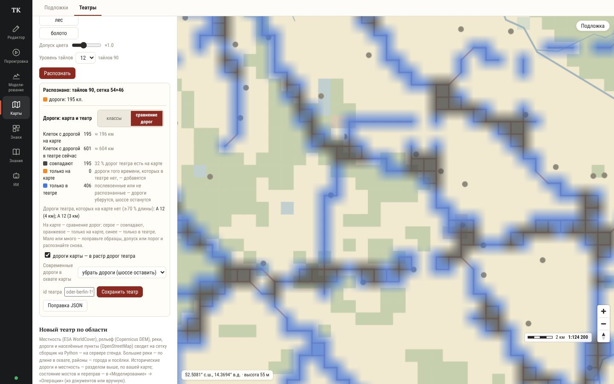

*Сравнение дорог: серое — совпадают, синее — есть только в театре (на исторической карте их нет), оранжевое — только на карте. Справа таблица: 195 клеток совпадают, 406 — только в театре.*

Результат сохраняется как новый театр (`id` задаёт пользователь) и используется в расчёте так
же, как встроенный.


*Раздел «Карты → Театры»: театр Одер — Берлин со слоем рельефа (Copernicus DEM) и реками; слои дорог, районов и растра местности выключены.*

**Состояние инфраструктуры операции.** Театр описывает мосты и переправы, известные при его
сборке. Сверх этого у операции есть список сведений об инфраструктуре: мост разрушен с такой-то
даты, переправа наведена, шоссе заминировано, железная дорога перекрыта. Сведения приходят из
документов операции (модель выписывает их с дословной цитатой, человек принимает) или вводятся
вручную. Каждое сведение привязывается к театру и ложится поверх него при расчёте и в игре:

| Сведение | Как действует в расчёте |
|---|---|
| мост разрушен | мост театра закрыт с даты сведения |
| мост цел, переправа наведена | переправа действует с даты (до даты окончания, если есть) |
| дорога перекрыта, заминирована, непроходима | в радиусе (по умолчанию 1,5 км) дорога не даёт дорожного темпа |
| железная дорога разрушена или перекрыта | препятствие в радиусе |
| повреждён, но проходим; рубеж без привязки | в расчёт не входит, остаётся сведением в базе знаний |

Исходный театр при этом не меняется: сведения хранятся отдельно, по операции, и попадают в
пакет операции при выгрузке.

**Ледостав.** Карта местности может указать период, когда большие реки скованы льдом.
Для Висло-Одерской операции это 20.12.1944–10.02.1945: реки преодолимы всеми родами войск с
задержкой на переправу. В Берлинской операции (апрель) льда нет.

| Карта | Охват | Клетка | Содержание |
|---|---|---|---|
| `oder-berlin-1945` | 11,0–15,6° в. д., 50,9–54,45° с. ш. | 2 км | 6 оборонительных полос, 98 мостов и переправ, 239 районов |
| `berlin-city-1945` | Берлин | 250 м | 3 кольца обороны, 21 мост, 246 районов |
| `vistula-oder-1945` | 14,0–22,6° в. д., 49,6–53,8° с. ш. | 2 км | 3 полосы, 132 моста и переправы, 163 района; без исторической поправки |

### 17.3. Профили сторон (`data/profiles/`)

Профиль описывает армию эпохи: типы частей, скорости, расход, подвоз, задержку доведения
приказов. Числа профилей — порядок величин по уставным нормам и обобщённым данным, не калибруются.

| | РККА 1945 | Вермахт 1945 |
|---|---|---|
| Скорость по дорогам, км/сут: пешие / авто / гусеничные | 30 / 150 / 100 | 28 / 120 / 80 |
| Вне дорог, открытая местность (пешие / авто / гусеничные) | 25 / 60 / 50 | 22 / 50 / 40 |
| Лес / болото / застройка (пешие) | 15 / 8 / 12 | 14 / 7 / 12 |
| Задержка доведения приказа, ч: армия / корпус / дивизия | 6 / 4 / 3 | 8 / 6 / 4 |
| Подвоз в сутки, боекомплектов / заправок | 0,6 / 0,6 | 0,3 / 0,2 (острый дефицит горючего) |
| Запас не более, боекомплектов / заправок | 3 / 2 | 2 / 1 |
| Дальность подвоза (автотранспортом по своей территории) | 48 ч | 48 ч |

Типы частей и их качество (выучка, слаженность; 1 — норма эпохи) и ширина полосы обороны:

| РККА | качество | полоса, км | Вермахт | качество | полоса, км |
|---|---|---|---|---|---|
| общевойсковая армия | 1,0 | 24 | армейский корпус | 0,95 | 24 |
| ударная армия | 1,05 | 20 | танковый корпус | 1,0 | 18 |
| гвардейская армия | 1,1 | 20 | танковый корпус СС | 1,05 | 18 |
| танковая армия | 1,1 | — | горный корпус | 0,9 | 20 |
| стрелковый корпус | 1,0 | 8 | пехотная / парашютная дивизия | 0,9 | 8 |
| танковый корпус | 1,05 | — | танковая дивизия | 1,0 | 5 |
| механизированный корпус | 1,05 | — | моторизованная дивизия (и СС) | 1,0 / 1,05 | 6 |
| кавалерийский корпус | 1,0 | — | гарнизон крепости | 0,8 | 6 |
| | | | фольксштурм | 0,5 | 6 |

Гарнизон крепости помечен как **узел, который обходят**: подвижные соединения, чья цель
дальше крепости, обходят её, а не штурмуют (Познань в январе 1945 г.).

### 17.4. Правила боя (`data/rules/`)

Правила — это таблицы и коэффициенты арбитра. Их форма задана по обобщённым данным о боях
Второй мировой войны, числа подобраны калибровкой по Берлинской операции (раздел 21).

| Файл | Что |
|---|---|
| `ww2-draft.json` | исходные правила до калибровки |
| `ww2-berlin-cal.json` | откалиброванные по Берлинской операции (основные; с блоком `calibration`: на чём и как подобраны) |
| `ww2-berlin-city.json`, `ww2-berlin-city-cal.json` | городской масштаб (раздел 23) |

Полные таблицы — в приложении А.

## 18. Сценарий

Сценарий собирается из рецепта (`tools/scenario/build_scenario.ts`). Рецепт перечисляет, какие
формирования действуют, их численность, задачи, источники подвоза и события для проверки.

### 18.1. Состав и численность

Численность известна в основном для фронтов и армий в целом. Она распределяется по
действующим формированиям сверху вниз по подчинённости:

1. **Боевая доля.** От списочной численности фронта берётся боевая: 0,6 для советских фронтов
   (без воздушной армии, тыла, фронтовых частей) и 0,75 для немецких армий (Kampfstärke). Одно
   мерило для обеих сторон — обязательное условие: иначе калибровка подгоняет коэффициенты под
   разницу в учёте, а не под бой.
2. **Явные цифры** (например, 1-я гв. ТА — 854 танка по Катукову) вычитаются из общего пула.
3. **Остаток** делится между формированиями без явных цифр пропорционально числу дивизий.
   Орудия — с весом: на направлениях главного удара — артиллерийские корпуса прорыва (у 8 гв. А
   и 5 уд. А до 270 орудий на километр; вес до 2,0).

Пример: 1-й Белорусский фронт — 908 500 человек, 3155 танков, 16 934 орудия (Кривошеев);
9-я немецкая армия — 112 143 человека, 512 танков, 2500 орудий и минометов (с зенитками в
наземной роли).

На Зееловских высотах немецкие корпуса разложены на дивизии; корпус остаётся штабом, задача
штаба передаётся его действующим дивизиям.

### 18.2. Задачи

Обе стороны получают исторические **задачи** (не положения): наступать на пункт или на
формирование противника, обороняться, держаться любой ценой, отходить, прорываться,
перегруппироваться, стоять в резерве. Формат в рецепте:

```
[формирование, "ММ-ДД[TЧЧ]", задача, цель, примечание с источником]
["su_8gva", "04-16", "attack", "Seelow", "главный удар с Кюстринского плацдарма (Ziemke p.474)"]
["de_xi_ss", "04-21T17", "hold", null, "приказ Гитлера держать фронт на Одере (Le Tissier, Halbe)"]
```

Цель — пункт из справочника, координаты или `@формирование`. Если час не указан, приказ
отдаётся в 18:00. Исполнитель получает его с **задержкой доведения** по профилю (армии РККА
6 ч, корпусу вермахта 6 ч). В Берлинской операции 245 приказов, в Висло-Одерской — 232.

Ключевые исторические решения заложены как задачи, например: приказы Гитлера держаться на
Одере для XI тк СС, V гск СС и V ак (21.04, отход разрешён 23.04) — без них не получается котёл
9-й армии; контрудары резервов на Зееловских высотах («Курмарк», 25-я и 18-я мд, «Мюнхеберг»,
«Нордланд»); приказ Хейнрици оставить крепость Штеттин 25.04.

### 18.3. Подвоз

Каждой стороне задаются **источники подвоза**: переправы, станции, тыловые районы. Источники
могут появляться и пропадать по датам (склады идут за наступлением; узел, потерянный
противником, перестаёт снабжать). В Берлинской операции советские источники — переправы на
Одере и Нейсе (Кюстрин, Губин, Гоздовице…), немецкие — Бранденбург, Магдебург, Ратенов,
Нойбранденбург, Росток, Дрезден, Каменц. Берлин — не источник: склады города снабжают гарнизон,
а подвоза в 9-ю армию через город не было.

## 19. Ход: как считается

Ход длится `turnHours` (24 ч на оперативном масштабе). Порядок внутри хода фиксирован;
каждое изменение записывается в журнал с причиной. Ход не меняет состояние на месте, а
возвращает новое — поэтому любой ход можно повторить и разобрать.

1. **Приказы**, дошедшие до исполнителя к концу хода (с учётом задержки доведения).
2. **Территория и подвоз** на начало хода.
3. **Бои**: все наступающие в соприкосновении с противником.
4. **Движение** остальных по маршрутам.
5. **Расход и подвоз, усталость, подготовка обороны, потеря боеспособности.**
6. **Территория**: клетки, через которые прошли войска, переходят к их стороне.
7. **Прорыв полос**: клетки чужих укреплённых полос, занятые противником, считаются прорванными.

### 19.1. Боевой потенциал

```
сила = (люди/1000 · 1,0 + танки · 0,08 + орудия · 0,03) · качество · снабжение · усталость
```

- *снабжение* — при боекомплекте меньше 0,5 сила падает линейно до 0,4; техника без горючего — 0,5;
- *усталость* — `1 − усталость · 0,4` (усталость от 0 до 1).

Веса означают: 1000 человек ≈ 12,5 танка ≈ 33 орудия. Это упрощение; оно одинаково для обеих
сторон.

### 19.2. Бой

**Кто с кем.** Наступающий вступает в бой, если противник ближе дистанции соприкосновения
(6 км) или ближе половины ширины полосы обороны противника. Например, армейский корпус в
обороне связывает боем всех в радиусе 12 км. Наступающие, у которых общие обороняющиеся,
образуют одно сражение.

**Соотношение сил:**

```
оборона = сила · местность · подготовка · укрепления
соотношение = Σ сила наступающих / Σ оборона · случайность
```

| Поправка обороны | Откалиброванное значение |
|---|---|
| местность: лес / высоты | 1,35 |
| болото | 1,47 |
| застройка | 1,59 |
| подготовленная оборона (стоит в обороне ≥ 24 ч) | 1,66 |
| укрепления | 1 + 0,32 · уровень полосы (1–3) |
| случайность | `exp(0,2 · N(0,1))`, то есть ±20 % в типичном бою |

**Темп продвижения** (км/сут) берётся из таблицы по соотношению сил (интерполяция в
логарифмической шкале) и умножается на поправку местности обороняющихся: застройка 0,47,
болото 0,5, лес 0,6, высоты 0,8. В укреплённой полосе темп не выше предела для её уровня:
14,7 / 9,2 / 5,5 км/сут для уровней 1 / 2 / 3. Это «прогрызание» обороны: на Зееловских
высотах 17–18.04 фактически до 4 км в сутки (Le Tissier), у 8 гв. А 16.04 — 3–6 км (Исаев).

| Соотношение | 1 | 1,5 | 2 | 3 | 4 | 6 | 10 |
|---|---|---|---|---|---|---|---|
| Темп, км/сут | 0 | 1,2 | 3,5 | 7,0 | 11,6 | 20,9 | 34,8 |
| Потери наступающих, % в сутки | 5,7 | — | 3,5 | 2,1 | — | 1,1 | 0,7 |
| Потери обороняющихся, % в сутки | 2,3 | — | 4,5 | 6,8 | — | 13,5 | 22,5 |

**Прорыв** — темп без предела полосы не меньше 10 км/сут. Предел полосы ограничивает скорость,
но не исключает прорыв.

**«Держаться любой ценой».** Обороняющиеся с этим приказом и окружённые не отходят, несут
полуторные потери, а наступающие не продвигаются, пока оборона не прорвана. Исключение —
**уличный бой**: если все обороняющиеся в застройке, наступающие берут квартал за кварталом
с городским темпом, а гарнизон остаётся на месте. Без этого исключения армия стояла бы перед
гарнизоном Берлина (в оперативном сценарии — одна точка), пока он не рухнет целиком.

**Потери** распределяются: личный состав — по таблице; танки — в 1,3 раза больше; орудия — в 0,8.
Формирование, у которого осталось меньше 15 % исходной численности, теряет боеспособность.

**Отход.** Обороняющиеся (кроме держащихся) отходят на расстояние продвижения противника. Из 16
направлений выбирается то, где подвоз ближе (к своим тылам); при равенстве — прочь от
наступающих. Отход в воду и туда, куда подвоз не доходит, исключён.

**Журнал боя** хранит все факторы: силы сторон, местность, подготовку, укрепления, случайность,
темп, предел полосы, исход («прорыв», «продвижение», «отражено», «удержано»). Отчёт показывает
каждый бой, поэтому любой исход можно объяснить.

### 19.3. Движение

**Маршрут** — кратчайший по времени путь по клеткам (алгоритм A*). Время клетки зависит от
скорости по профилю: по шоссе — полная дорожная скорость, по дороге — 85 % от неё, вне дорог —
по классу местности. Сверх этого добавляются задержки:

| Причина | Задержка |
|---|---|
| большая река без моста | пешим 12 ч; технике — непроходима (если нет ледостава) |
| малая река | 4 ч |
| клетка чужой укреплённой полосы (пока не прорвана) | 4 ч за уровень |
| клетка территории противника | `клетка / темп по чужой территории`: пешим 42,6 км/сут, технике 136 км/сут (заслоны, разрушения, зачистка) |

Все скорости умножаются на общий множитель движения (1,09 после калибровки).

**Дороги.** Клетка с дорогой даёт дорожную скорость, поэтому кратчайший по времени путь сам
тянется к дорогам: на марше и в городе войска идут дорогами и улицами, а не по прямой через
кварталы. Перекрытая или заминированная дорога (раздел 17.2) дорожной скорости не даёт, и
маршрут её обходит.

**Разброс путей.** Вне города дорога — не единственный выбор: соединение может пойти лесом или
полем напрямик. Чтобы этот выбор не терялся, при выборе пути время каждой клетки умножается на
плавный шум (районы 2–4 км) от 1 до 1 + 2 · *v*, где *v* — параметр правил `routeVariety`
(0,2 в откалиброванных правилах, то есть «кажущаяся» выгода клетки различается до 40 %).
Шум свой у каждого формирования и приказа и постоянен на прогон: путь не дёргается от хода к
ходу, а разные seed дают разные пути. Шум влияет **только на выбор пути**: время движения по
выбранному пути считается по местности, без шума, — средний темп не меняется.

**Показ на карте.** Расчёт ведёт войска по клеткам. Для карты путь хода перестраивается по
дорожной сети театра — графу из линий дорог, шоссе и улиц (перекрёстки — общие вершины и
пересечения линий): участок пути по клеткам с дорогой заменяется кратчайшим путём по графу между
точками, где войска вошли на дорогу и сошли с неё. Если весь ход шёл дорогами или городом, а
путь по улицам не длиннее полутора расчётных, ход целиком показывается улицами. Вне дорог (поле,
лес) путь остаётся таким, как в расчёте, только сглаженным, — показ не прячет выбор пути вне
дорог. Знак движется по вершинам пути, время — пропорционально пройденному расстоянию.

**Остановка у противника.** Наступающие останавливаются, войдя в соприкосновение (бой — в
следующий ход), остальные — не доходя до противника. Уже стоящий рядом с противником может
подойти до дистанции боя, но не сквозь него: пройти через противника без боя нельзя.

**Обход крепостей.** Подвижные соединения (танковые, механизированные), чья цель дальше
крепости, не вступают с ней в бой и обходят её. Пехота крепость штурмует.

### 19.4. Территория — сплошная полоса

Без территории фронт был бы цепочкой точек с пустыми промежутками, через которые танковые
корпуса проходили бы за сутки по 150 км. Поэтому каждая клетка принадлежит одной из сторон.

- **Исходная территория.** Каждая сторона «растекается» от своих войск и источников подвоза
  по клеткам. Переход через большую реку стоит 40 км пути, через чужую укреплённую полосу —
  20 км; оба штрафа платятся один раз, при входе в преграду. Поэтому граница ложится по Одеру,
  Нейсе и главной полосе обороны, а не посередине между ближайшими частями.
- **Изменение.** Клетки в радиусе 4 км от пути соединения за ход переходят к его стороне, если
  противник к ним не ближе. Клетка, где стоит соединение, — его стороны. Отходящие чужую
  территорию не занимают: иначе отход сквозь тыл противника рвал бы его коридоры подвоза.
- **Следствия:** в тылу противника движение медленнее; прорвавшаяся танковая армия снабжается
  только по коридору, который сама пробила; соединения, оставшиеся в чужом тылу, оказываются в
  котле.

**Линия фронта** на карте — граница территорий сторон, сглаженная. Она строится только там,
где обе стороны ближе 50 км.

### 19.5. Подвоз и окружение

**Время подвоза** к каждой клетке считается от источников стороны по своей территории
(автотранспортом по дорогам) с обходом мест, где стоят войска противника (радиус 3 км).
Формирование снабжается, если подвоз доходит до любой клетки в радиусе 3 км от него не дольше
48 ч. Армия занимает полосу в несколько километров, подвоз приходит к её тылу, а не к точке знака.

**Окружение** — подвоз не доходит дольше 36 ч (два хода подряд). Разовый разрыв на стыке
котлом не считается. Окружённые не пополняются и не могут отойти: держатся на месте с
повышенными потерями. На карте у знака пометка «ОТРЕЗАНО».

### 19.6. Расход, усталость, оборона

| Состояние | Боекомплектов в сутки | Заправок в сутки |
|---|---|---|
| наступление | 0,5 | 0,5 |
| оборона | 0,25 | 0,05 |
| марш | 0,02 | 0,4 |
| отход | 0,15 | 0,4 |
| резерв | 0 | 0,02 |

Вне боя расход боеприпасов — 30 % от нормы. Усталость растёт в бою (+0,15 в сутки) и на марше
(+0,08), снижается на отдыхе (−0,1). Оборона становится подготовленной после 24 ч на месте.

### 19.7. Случайность и воспроизводимость

Случайность одна — разброс исхода боя. Генератор задаётся числом seed: один seed — один и тот
же расчёт до последнего знака. Разброс исходов оценивается прогоном с разными seed (обычно 5).

## 20. Сравнение с историей

**Положения.** Каждое историческое положение «за день» сравнивается с первым снимком расчёта
не раньше его времени. Отклонение — расстояние между расчётным и историческим положением.
**Сверх неопределённости** — отклонение за вычетом радиуса `approx_km` исторической записи.
Положение считается **в допуске**, если превышение не больше 10 км (в городе — 2 км).

**События.** Проверяются ключевые события с датой:

| Вид | Когда считается случившимся |
|---|---|
| выход к пункту | войска стороны в радиусе пункта; для «город взят» — и нет боеспособных частей противника в том же радиусе |
| окружение | хотя бы одно из перечисленных формирований отрезано (или уничтожено) |
| встреча | все перечисленные формирования в радиусе пункта |

Событие не может случиться до начала сценария. Событию можно назначить **отметку на карте**:
так, взятие Рейхстага ставит Знамя Победы в момент события в расчёте и бледное знамя — на
историческое время (30.04, 22:40 по советским донесениям).

**Отчёт** (`report.md`) содержит: события (история / расчёт / расхождение в сутках);
отклонения по дням и по формированиям; наибольшие расхождения с историческим местом, источником
и достоверностью; журнал боёв с факторами; разброс по прогонам.

## 21. Калибровка

**Что подбирается.** 11 множителей к исходным правилам:

| Параметр | Границы поиска | Итог |
|---|---|---|
| темп продвижения (вся таблица) | ×0,3…1,6 | ×1,16 |
| потери наступающих | ×0,5…2 | ×1,42 |
| потери обороняющихся | ×0,5…2 | ×1,12 |
| подготовленная оборона | 1,0…2,2 | 1,66 |
| укрепления, за уровень | 0…0,8 | 0,32 |
| показатель местности (поправки обороны в степени) | 0,5…2,5 | 1,15 |
| скорость движения | ×0,4…1,2 | ×1,09 |
| темп в застройке | 0,05…0,6 | 0,47 |
| предел темпа в полосе | ×0,4…2 | ×1,83 |
| темп по чужой территории, пешие, км/сут | 10…80 | 42,6 |
| то же, техника | 15…150 | 136 |

**Мерило:**

```
мерило = среднее превышение отклонения положений над неопределённостью (каждое — не больше 50 км)
       + 3 × средняя ошибка дат событий (сут; не случилось — 6 сут)
```

**Обучение и проверка.** Подбор идёт только по положениям и событиям **до 25.04 включительно**;
дни после 25.04 — проверка: по ним видно, не подогнана ли модель под конкретные числа. Поиск:
40 % вычислений — случайные точки по всему диапазону, затем уточнение вокруг лучшей точки с
уменьшающимся шагом; каждая точка оценивается по двум прогонам (seed 101, 102). 200 вычислений
занимают около 11 минут.

**Итог:** обучение — превышение 9,6 → 5,2 км, ошибка дат событий 3,25 → 0,75 сут;
проверка — 6,8 → 4,4 км.

**Выбор между двумя калибровками.** После последних исправлений движка калибровка была
повторена; новые правила дали на пяти прогонах 48 событий из 55 в пределах двух суток против 50
у прежних, и прежние оставлены. Этот выбор сделан по всем событиям, включая проверочные, —
поэтому проверка здесь уже не вполне независима. Независимая проверка — контрольная операция
(раздел 22).

## 22. Результаты

Пять прогонов на сценарий (seed 1–5), команда `npm run sim:demo`. Расчёт — с движением по
дорогам и разбросом путей (раздел 19.3). Правила откалиброваны до того, как в движок добавлено
движение по дорогам, и после этого не перекалибровывались.

### 22.1. Берлинская операция, 16.04–2.05.1945

53 действующих формирования (24 советских, 29 немецких), 245 приказов, 223 исторических
положения для сравнения. В допуске ±10 км — **75–82 %** (по прогонам 79, 82, 80, 75, 82 %).
События (расхождение в сутках по пяти прогонам; «—» — не случилось):

| Событие | История | Прогоны 1–5 |
|---|---|---|
| Прорыв к Мюнхебергу | 19.04 | — +1 — +1 +1 |
| 1 УФ форсировал Шпрее у Шпремберга | 18.04 | +1 +1 — +1 +1 |
| 3 гв. ТА у Цоссена | 21.04 | +1 +1 +1 +1 +1 |
| Окраины Берлина | 21.04 | 0 0 +1 +2 0 |
| Котёл 9-й армии | 24.04 | −2 −2 −2 −1 −2 |
| V ак у Котбуса отрезан | 24.04 | +2 — — +3 — |
| Кольцо у Кетцина | 25.04 | −1 −1 −1 0 −1 |
| Торгау | 25.04 | 0 0 — 0 0 |
| Штеттин взят | 26.04 | — −1 −1 −1 −1 |
| Бой за Рейхстаг | 30.04 | −2 −2 −1 — −2 |
| Рейхстаг взят — Знамя Победы | 30.04 | −2 −2 −1 — −1 |

**44 из 55** в пределах двух суток. При разбросе путей часть соединений идёт не самой быстрой
дорогой, поэтому в двух прогонах из пяти прорыв к Мюнхебергу не засчитывается в срок, а V ак
у Котбуса не попадает в котёл. Котёл 9-й армии — на 1–2 суток раньше истории, бой за Рейхстаг —
на сутки-двое раньше. Сравнение
исходных и откалиброванных правил в стенде (4 прогона) — на снимке в разделе 7:
80 % против 72 % положений, 35 против 20 событий из 44.

### 22.2. Бой в Берлине, 24.04–2.05.1945

31 действующее формирование: советские корпуса и немецкие дивизии LVI тк, гарнизоны секторов
A–H и Z, гарнизон башни «Зоо». В допуске ±2 км — **84–92 %**.

| Событие | История | Прогоны 1–5 |
|---|---|---|
| Аэропорт Темпельхоф взят | 26.04 | 0 +1 — 0 0 |
| Александерплац | 29.04 | −3 −4 −4 −4 −4 |
| Мост Мольтке | 29.04 | — — — — — |
| Рейхстаг | 30.04 | −1 — — 0 +1 |
| Встреча 2 гв. ТА и 3 гв. ТА у Савиньиплац | 2.05 | −2 — −1 −3 −2 |
| Рейхсканцелярия | 2.05 | −2 — −1 −2 −1 |

**14 из 30** в пределах двух суток. Темпельхоф и Рейхстаг — в срок; Александерплац — на 3–4
суток раньше истории; мост Мольтке не засчитывается ни в одном прогоне. Причина —
гарнизон сектора в модели представлен точкой, а не районом (раздел 25).

### 22.3. Контрольная: Висло-Одерская операция, 12.01–3.02.1945

Правила Берлинской операции **без изменений и без подгонки**. 58 действующих формирований
(немецкие — дивизиями), 232 приказа, 185 положений. В допуске ±10 км — **46–54 %**.

| Событие | История | Прогоны 1–5 |
|---|---|---|
| Кельце взят | 15.01 | +1 — +1 — — |
| Радом взят | 16.01 | −2 −2 −2 −2 −2 |
| Варшава освобождена | 17.01 | −1 −1 −1 −1 −1 |
| Ченстохов взят | 17.01 | −3 −3 −3 −3 −3 |
| Лодзь освобождена | 19.01 | 0 0 0 0 0 |
| Краков освобождён | 19.01 | −6 −6 −6 −6 −6 |
| 4 ТА на Одере у Штейнау | 22.01 | — — — — — |
| Калиш взят | 23.01 | +8 — +8 — — |
| Оппельн — 3 гв. ТА на Одере | 24.01 | −4 −4 −4 −4 −4 |
| Познань окружена | 25.01 | — — — — — |
| Катовице взят | 28.01 | −7 −6 −6 −6 −6 |
| Прорыв Мезерицкого УР | 29.01 | — — — — — |
| Выход к Одеру у Кинитца | 31.01 | — — — — — |

**17 из 65** в пределах двух суток: Радом, Варшава, Лодзь — во всех прогонах, Кельце — в
части. Ченстохов и Оппельн — на 3–4 суток раньше, Краков и Катовице — на 6–7; выход к Одеру,
окружение Познани и прорыв Мезерицкого укреплённого района не наступают.

Что показала контрольная операция: модель переносится на чужую операцию в фазе прорыва
(первые 5–7 дней), но не в фазе преследования. Причины: немецкая оборона на юге в данных
неполна (у 12 из 29 дивизий положение — оценка); исторические положения конца января записаны
по передовым отрядам, а модель ведёт главные силы; местность без исторической поправки.
Контрольная операция также выявила четыре ошибки движка, исправленные до финальной калибровки
(предел темпа в полосе исключал прорыв; тупик у противника; нет обхода крепостей; нет ледостава).

## 23. Городской масштаб

Бой в городе считается на отдельной карте (клетка 250 м, ход 12 ч) с правилами, наследующими
откалиброванные с поправками:

- дистанция соприкосновения — 1,5 км вместо 6;
- «держаться» — не отходить по своей воле, но под натиском уступать кварталы;
- крепости не обходятся: в городе гарнизоны и есть цель;
- темп и потери подобраны отдельно по дням до 28.04 (проверка — 29.04–2.05).

Гарнизон города (~60 000) распределён по секторам обороны A–H и Z по долям из Le Tissier.
Советские корпуса — с оценочной численностью (C).

## 24. Что меняется при подключении ИИ

Правила арбитра не меняются. Меняется источник приказов немецкой стороны: вместо исторических задач —
решения модели, которая на каждом ходе получает обстановку (свои силы, известное о противнике,
местность, подвоз, приказы сверху) и отдаёт приказы в том же формате (задача, цель, примечание
с обоснованием). Модель видит только то, что мог знать немецкий штаб на эту дату; её решения
проходят через ту же задержку доведения. Отчёт сравнения покажет, где решения модели увели
операцию от истории и к чему это привело.

**Посредник на модели** (по желанию, в игре и в проверке `npm run llm:umpire`). Перед ходом модель видит
ожидаемые бои (наступающий и противник в пределах 1,5 дистанции соприкосновения: состав, численность, боеприпасы,
усталость, местность, полоса, водная преграда) и справки из базы знаний — доктрину, нормативы, технику (не ход боёв
в истории: это подсказка исхода). Она может дать поправку к бою — множитель силы наступающих, силы обороны, темпа
или потерь в пределах 0,8–1,25 — только с причиной и опорой на справку или обстановку. То, что арбитр уже
учитывает (соотношение сил, местность, подготовленная оборона, полосы, усталость, снабжение), повторно не
поправляется. Поправка действует один ход на бои с участием названных формирований, в журнале боя видна как
множитель «посредник: …», записывается в игру — переигровка точна. Полезность проверяется сравнением прогонов
с посредником и без (сверка с историей и нормативы; контрольная — Висло-Одерская).

## 25. Ограничения и развитие

### 25.1. Модель переигровки: известные расхождения

1. **Соединение — точка с полосой.** Гарнизон сектора или корпус в обороне — точка с радиусом,
   а не занимаемый район. Отсюда в городе события в центре наступают раньше истории.
2. **Местность современная** там, где нет исторической поправки: железные дороги, построенные
   после войны каналы, выросшие пригороды. Для Висло-Одерской операции поправки нет совсем
   (её можно сделать в стенде по своей карте — раздел 17.2). Разлив Одербруха в апреле 1945 г.
   не учтён.
3. **Дороги на показе и в расчёте.** Расчёт ведёт войска по клеткам (2 км; в городе 250 м),
   на карте путь перестраивается по линиям дорог. Поэтому показанный путь может немного
   отличаться от расчётного, а время хода — нет. Где у театра дороги есть только растром (без
   линий), путь показывается по клеткам.
4. **Исходные точки на реке.** 52-я армия и 2-я армия Войска Польского у Ротенбурга стоят прямо
   на Нейсе; территория вокруг делится неудачно, и они числятся отрезанными со второго хода.
   На события это не влияет.
5. **Численность** части объединений — оценка (C), в том числе боевые доли 0,6 и 0,75.
6. **Авиация** не моделируется отдельно; её вклад сидит внутри откалиброванных таблиц темпа и
   потерь. Артиллерия — числом орудий в силе соединения.
7. **Калибровка по одной операции.** Контрольная проверка — одна операция другого типа.
   Для уверенных выводов нужны ещё операции.
8. **Исторические задачи** записаны составителем по книгам: выбор формулировки и даты влияет
   на расчёт. Каждая задача снабжена источником.
9. **Полнота материалов — не оценка модели.** Она показывает, есть ли в базе знаний сведения по
   каждому элементу операции, но не проверяет, верны ли они. Сверка базы со сценарием
   (раздел 8.3) переносит только численность, танки и орудия; состав, подчинённость и задачи
   сценария из базы не меняются.
10. **Пересчёт по одной операции.** Подбор множителей идёт по истории одной операции и легко
    подгоняется под неё; контрольная операция и перепроверка на пяти прогонах это ловят, но не
    исключают. Основными правила делает человек.

### 25.2. Система: что заменить при развитии

| Сейчас | Затем |
|---|---|
| свои операции, игры и слой базы знаний — в браузере | хранение на сервере, общий доступ команды |
| API-ключи из переменной | OIDC (Keycloak), роли и права на слои |
| шина событий в памяти сервиса | NATS, Kafka или Redis Streams |
| растры подложек в документе, тайлы на диске | объектное хранилище, MBTiles или PMTiles |
| немецкой стороной модель командует войсками; тыл, переправы и резервы противника — по историческому графику | штабная работа модели целиком |
| модель откалибрована по одной операции, проверена на второй | больше операций для калибровки и проверки |
| из базы в сценарий переносятся численность, танки, орудия | состав, подчинённость и задачи из базы |

## 26. Где что лежит и как воспроизвести

| Путь | Что |
|---|---|
| `packages/sim/src/step.ts` | ход: приказы, бои, движение, подвоз, территория |
| `packages/sim/src/rules.ts` | сила, интерполяция таблиц |
| `packages/sim/src/control.ts` | территория, проходимость для подвоза, поле времени подвоза |
| `packages/sim/src/theatre.ts` | сетка местности, маршруты, скорости, переправы |
| `packages/sim/src/roadnet.ts` | дорожная сеть театра и показ пути по дорогам |
| `packages/sim/src/infrastructure.ts` | сведения об инфраструктуре и их наложение на театр |
| `packages/sim/src/overlay.ts` | исторический слой по карте: классы по цвету, наложение, сравнение дорог |
| `packages/sim/src/history.ts` | прогон, сравнение с историей, события |
| `packages/sim/src/publish.ts` | карта для редактора |
| `packages/sim/tools/scenario/build_scenario.ts` | сборка сценария из рецепта |
| `packages/sim/tools/theatre/build_theatre.py` | сборка карты местности |
| `packages/sim/tools/run/history.ts`, `calibrate.ts` | исторический прогон и калибровка |
| `packages/sim/tests/` | проверки движка (47) |
| `packages/knowledge/src/coverage.ts`, `hints.ts` | полнота по каркасу и подсказки, что искать |
| `packages/knowledge/src/operations.ts`, `extract.ts` | разделы операций в базе, разбор документов |
| `apps/editor/src/modeling/Materials.tsx`, `Coverage.tsx` | материалы операции, полнота в стенде |
| `apps/editor/src/HistLayer.tsx` | исторический слой по своей карте |
| `packages/knowledge/src/sync.ts` | сверка базы со сценарием, формирование по названию из документа |
| `apps/editor/src/modeling/sync.ts`, `SyncPanel.tsx` | правки сценария и положения из документов, панель сверки |
| `apps/editor/src/modeling/RecalcPanel.tsx` | пересчёт модели: калибровка, перепроверка, контрольная, отчёт |
| `apps/editor/src/sim/userdata.ts` | правки операции поверх сценария и истории, журнал изменений |

```bash
npm run sim:demo                                   # три сценария, отчёты и карты
npm run sim:history -- --scenario berlin-1945-tasks --runs 5
npm run sim:calibrate -- --evals 200 --seeds 2     # ~11 минут
npm test
```

## 27. Документы

| Документ | О чём |
|---|---|
| [simulation-quickstart.md](simulation-quickstart.md) | переигровка, игра, знания — по шагам |
| [architecture.md](architecture.md) | архитектура платформы |
| [data-model.md](data-model.md) | реестр объектов и время |
| [cartography.md](cartography.md) | карты-подложки в закрытом контуре |
| [library.md](library.md), [library.pdf](library.pdf) | библиотека условных знаков |
| [openapi.yaml](openapi.yaml) | контракт API |
| [plans/simulation.md](plans/simulation.md) | замысел и этапы переигровки |

## Приложение А. Откалиброванные правила (`ww2-berlin-cal`)

| Параметр | Значение |
|---|---|
| Дистанция соприкосновения | 6 км |
| Случайность исхода боя (σ логнормального множителя) | 0,2 |
| Прорыв | темп ≥ 10 км/сут |
| Поправки обороны по местности | открытая 1; лес 1,352; высоты 1,352; болото 1,472; застройка 1,593 |
| Подготовленная оборона | ×1,658 после 24 ч на месте |
| Укрепления | +0,32 за уровень |
| Темп по местности обороняющихся | застройка 0,469; лес 0,6; болото 0,5; высоты 0,8 |
| Предел темпа в полосе, уровни 1/2/3 | 14,65 / 9,16 / 5,49 км/сут |
| Задержка: большая река без моста | 12 ч (пешим) |
| Задержка: клетка укреплённой полосы | 4 ч за уровень |
| Территория | радиус занятия 4 км; темп по чужой: пешие 42,6, техника 136,1 км/сут |
| Окружение | подвоз не доходит 36 ч |
| Нехватка боеприпасов / горючего | сила до ×0,4 / ×0,5 |
| Влияние усталости | до −40 % силы |
| Множитель скорости движения | 1,087 |

Таблицы темпа и потерь — в разделе 19.2.
